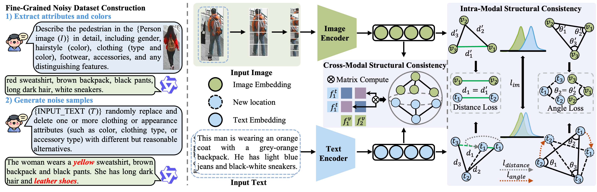

# Learning Structure-Consistent Alignment under Fine-Grained Noisy Correspondences for Text-Based Person Retrieval

## Introduction
Current research on noisy correspondence often uses a simple whole-text swapping method, where the entire text description of one pedestrian is swapped with another's image. This approach, while easy to implement, has significant limitations. It creates noise that is too extreme and does not reflect real-world annotation errors, which are typically local and semantic (e.g., color or clothing mistakes). Whole-text swapping results in completely mismatched identity-level descriptions, which is more severe than common annotation biases. Additionally, it disrupts fine-grained semantic associations necessary for precise cross-modal alignment, leading to models that rely too heavily on identity cues and fail to handle partial text corruption effectively. Therefore, developing datasets with more realistic, fine-grained noise is crucial.

#### The fine-grained noisy datasets we constructed, covering multiple noise ratios, have been publicly released to support the research community. The data can be accessed via the following links:

##### CUHK-PEDES (Fine-Grained Noisy Dataset) 
[Click here](https://drive.google.com/drive/folders/110joLizRgsJWO6IYxvpm6DGJy1kxwdpC?usp=sharing)

---
##### ICFG-PEDES (Fine-Grained Noisy Dataset)
[Click here](https://drive.google.com/drive/folders/1arQH2dtyl5SPzoyW1_9hV3ORGKFUdTJJ?usp=sharing)

---
##### RSTPReid (Fine-Grained Noisy Dataset)
[Click here](https://drive.google.com/drive/folders/1pgZN4eIKkmVNhEvVqEGrWSVEGbRbrUBx?usp=sharing)

---
#### Overall framework


---
# usage
---

## Requirements
we use single RTX3090 24G GPU for training and evaluation.
```javascript {.class1 .class}
pytorch 1.9.0
torchvision 0.10.0
prettytable
easydict
```
## Prepare Datasets
```
|-- your dataset root dir/
|  |-- <CUHK-PEDES>/
|    |-- imgs/
|      |-- cam_a
|      |-- cam_b
|      |-- ...
|    |-- reid_raw.json
|  |-- <ICFG-PEDES>/
|    |-- imgs/
|      |-- test
|      |-- train
|    |-- ICFG_PEDEST.json
|  |-- <RSTPReid>/
|    |-- imgs
|    |-- RSTPReid.json
```
## Training and Evaluation
---
## Training
```
sh run.sh
```
## Evaluation
```
python test.py
```
---

#### Our training logs are published [here](https://drive.google.com/drive/folders/13reB914CEcmh3k1aB77hnlr5eYSm613Q?usp=sharing)

We conducted comprehensive performance evaluations on four baseline models using our **fine-grained noisy datasets** under varying noise ratios.
| Noise   | Method | **CUHK-PEDES**                          |                             |                             |            |            | **ICFG-PEDES**                          |                             |                             |            |            | **RSTPReid**                            |                             |                             |            |            |
|---------|--------|-----------------------------------------|-----------------------------|-----------------------------|------------|------------|-----------------------------------------|-----------------------------|-----------------------------|------------|------------|-----------------------------------------|-----------------------------|-----------------------------|------------|------------|
|         |        | R@1     | R@5     | R@10    | mAP       | mINP       | R@1     | R@5     | R@10    | mAP       | mINP       | R@1     | R@5     | R@10    | mAP       | mINP       |
| **0%**  | CFine  | 69.57   | 85.93   | 91.15   | –         | –          | 60.83   | 76.55   | 82.42   | –         | –          | 50.55   | 72.50   | 81.60   | –         | –          |
|         | IRRA   | 73.38   | <u>89.93</u>   | 93.71   | 66.13     | <u>50.24</u>     | 63.46   | 80.25   | 85.82   | 38.06     | **7.93**        | 60.20   | 81.30   | 88.20   | 47.17     | <u>25.28</u>     |
|         | CFFA   | <u>75.44</u>   | 89.88   | <u>94.01</u>   | <u>67.03</u>    | –          | <u>66.50</u>   | <u>81.68</u>   | <u>86.82</u>   | <u>39.44</u>    | –          | <u>62.85</u>   | <u>83.10</u>   | <u>89.65</u>   | <u>49.68</u>    | –          |
|         | RDE    | **75.94**      | **90.14**      | **94.12**      | **67.56**       | **51.44**       | **67.68**      | **82.47**      | **87.36**      | **40.06**       | <u>7.87</u>      | **65.35**      | **83.95**      | **89.90**      | **50.88**       | **28.08**       |
| **5%**  | CFine  | 68.18   | 85.33   | 90.61   | –         | –          | 60.37   | 76.14   | 82.30   | –         | –          | 49.67   | 71.38   | 80.70   | –         | –          |
|         | IRRA   | 72.63   | 88.91   | 93.16   | 65.37     | <u>49.44</u>     | 63.16   | 80.06   | 85.64   | 37.99     | **7.88**        | 59.00   | 80.80   | 88.15   | 46.47     | <u>25.31</u>     |
|         | CFFA   | <u>73.98</u>   | <u>89.23</u>   | <u>93.45</u>   | <u>65.98</u>    | –          | <u>65.87</u>   | <u>81.22</u>   | <u>86.38</u>   | <u>38.90</u>    | –          | <u>62.07</u>   | <u>82.70</u>   | <u>89.13</u>   | <u>48.75</u>    | –          |
|         | RDE    | **75.26**      | **90.16**      | **94.15**      | **67.15**       | **50.85**       | **67.21**      | **82.38**      | **87.29**      | **39.81**       | <u>7.74</u>      | **64.40**      | **83.50**      | **89.55**      | **50.35**       | **27.36**       |
| **10%** | CFine  | 67.50   | 84.99   | 90.12   | –         | –          | 59.70   | 75.47   | 81.86   | –         | –          | 48.95   | 70.77   | 79.81   | –         | –          |
|         | IRRA   | 72.40   | <u>88.95</u>   | <u>93.10</u>   | 65.01     | <u>48.88</u>     | 62.63   | 79.87   | 85.48   | 37.66     | **7.81**        | 58.35   | 78.30   | 86.10   | 46.27     | <u>25.56</u>     |
|         | CFFA   | <u>72.67</u>   | 88.33   | 93.07   | <u>65.13</u>    | –          | <u>65.53</u>   | <u>80.85</u>   | <u>86.10</u>   | <u>38.24</u>    | –          | <u>61.58</u>   | <u>81.69</u>   | <u>88.78</u>   | <u>47.30</u>    | –          |
|         | RDE    | **75.06**      | **90.03**      | **93.92**      | **66.74**       | **50.48**       | **66.94**      | **82.33**      | **87.11**      | **39.56**       | <u>7.66</u>      | **62.55**      | **83.25**      | **89.85**      | **49.63**       | **27.21**       |
| **20%** | CFine  | 65.33   | 84.21   | 89.65   | –         | –          | 57.95   | 73.79   | 79.10   | –         | –          | 47.91   | 69.43   | 78.64   | –         | –          |
|         | IRRA   | 70.08   | <u>87.91</u>   | <u>92.58</u>   | 63.03     | <u>46.89</u>     | 62.20   | 79.14   | 84.83   | 36.91     | <u>7.30</u>      | 56.90   | 80.25   | 87.10   | 44.44     | <u>22.70</u>     |
|         | CFFA   | <u>71.28</u>   | 87.66   | <u>92.70</u>   | <u>64.50</u>    | –          | <u>64.67</u>   | <u>80.37</u>   | <u>85.94</u>   | <u>37.80</u>    | –          | <u>60.27</u>   | <u>81.33</u>   | <u>87.83</u>   | <u>46.25</u>    | –          |
|         | RDE    | **74.04**      | **89.31**      | **93.55**      | **65.89**       | **49.58**       | **66.48**      | **81.84**      | **86.96**      | **39.21**       | **7.38**        | **62.45**      | **82.20**      | **89.40**      | **48.22**       | **24.97**       |
| **30%** | CFine  | 63.04   | 83.06   | 88.78   | –         | –          | 56.70   | 71.13   | 75.27   | –         | –          | 45.25   | 67.46   | 75.39   | –         | –          |
|         | IRRA   | <u>69.40</u>   | <u>87.54</u>   | <u>92.02</u>   | 61.68     | <u>45.00</u>     | 61.52   | 78.78   | 84.66   | 36.30     | <u>7.02</u>      | 57.40   | <u>80.20</u>   | <u>87.80</u>   | 44.94     | <u>22.70</u>     |
|         | CFFA   | 68.70   | 85.92   | 91.30   | <u>62.33</u>    | –          | <u>64.06</u>   | <u>80.14</u>   | <u>85.77</u>   | <u>37.37</u>    | –          | <u>59.40</u>   | 80.00   | 87.18   | <u>45.43</u>    | –          |
|         | RDE    | **73.33**      | **88.39**      | **93.31**      | **64.88**       | **48.34**       | **65.87**      | **81.50**      | **86.63**      | **38.77**       | **7.20**        | **61.30**      | **82.05**      | **88.70**      | **47.41**       | **24.43**       |
| **40%** | CFine  | 61.91   | 81.77   | 88.14   | –         | –          | 53.39   | 68.51   | 72.44   | –         | –          | 42.59   | 63.13   | 70.62   | –         | –          |
|         | IRRA   | <u>67.27</u>   | <u>86.01</u>   | <u>91.00</u>   | 59.74     | <u>42.65</u>     | 60.71   | 78.11   | 84.25   | 35.75     | <u>6.81</u>      | 55.30   | 78.35   | 86.05   | 41.98     | <u>20.51</u>     |
|         | CFFA   | 66.47   | 85.26   | 90.47   | <u>60.40</u>    | –          | <u>63.72</u>   | <u>79.97</u>   | <u>85.62</u>   | <u>36.74</u>    | –          | <u>57.90</u>   | <u>79.36</u>   | <u>86.90</u>   | <u>44.78</u>    | –          |
|         | RDE    | **70.61**      | **87.18**      | **92.04**      | **62.06**       | **44.88**       | **64.94**      | **81.22**      | **86.32**      | **38.05**       | **6.91**        | **61.05**      | **81.10**      | **88.05**      | **46.82**       | **23.92**       |
| **50%** | CFine  | 59.81   | 80.34   | 86.97   | –         | –          | 51.20   | 64.83   | 68.70   | –         | –          | 40.73   | 61.49   | 68.47   | –         | –          |
|         | IRRA   | <u>65.81</u>   | <u>84.81</u>   | <u>90.56</u>   | <u>57.95</u>    | <u>40.45</u>     | 60.40   | 78.34   | 84.41   | 35.59     | **6.83**        | 53.50   | 76.25   | 85.15   | 41.27     | <u>20.46</u>     |
|         | CFFA   | 64.33   | 84.05   | 89.65   | 56.26     | –          | <u>63.46</u>   | <u>79.85</u>   | <u>85.46</u>   | <u>36.43</u>    | –          | <u>56.95</u>   | <u>78.50</u>   | <u>86.80</u>   | <u>44.20</u>    | –          |
|         | RDE    | **70.39**      | **86.89**      | **91.81**      | **62.13**       | **45.28**       | **64.37**      | **80.40**      | **85.74**      | **37.48**       | <u>6.49</u>      | **60.40**      | **80.50**      | **89.00**      | **46.58**       | **24.59**       |

---
Performance of four baselines **with SCA** on three **fine-grained noisy datasets** across noise ratios. Within each dataset group, the **best** and **second-best** results are shown in **bold** and <u>underline</u>, respectively.

| Noise | Method | **CUHK-PEDES**        |                     |                     |         |         | **ICFG-PEDES**       |                     |                     |         |         | **RSTPReid**         |                     |                     |         |         |
|-------|--------|------------------------|---------------------|---------------------|---------|---------|----------------------|---------------------|---------------------|---------|---------|----------------------|---------------------|---------------------|---------|---------|
|       |        | R@1                    | R@5                 | R@10                | mAP     | mINP    | R@1                  | R@5                 | R@10                | mAP     | mINP    | R@1                  | R@5                 | R@10                | mAP     | mINP    |
| **0%**    | CFine  | 69.57                  | 85.93               | 91.15               | –       | –       | 60.83                | 76.55               | 82.42               | –       | –       | 50.55                | 72.50               | 81.60               | –       | –       |
|       | IRRA   | 73.38                  | <u>89.93</u>       | 93.71               | 66.13   | <u>50.24</u> | 63.46                | 80.25               | 85.82               | 38.06   | **7.93**| 60.20                | 81.30               | 88.20               | 47.17   | <u>25.28</u> |
|       | CFFA   | <u>75.44</u>          | 89.88               | <u>94.01</u>       | <u>67.03</u> | –       | <u>66.50</u>        | <u>81.68</u>       | <u>86.82</u>       | <u>39.44</u> | –       | <u>62.85</u>        | <u>83.10</u>       | <u>89.65</u>       | <u>49.68</u> | –       |
|       | RDE    | **75.94**             | **90.14**           | **94.12**           | **67.56**| **51.44**| **67.68**           | **82.47**           | **87.36**           | **40.06**| <u>7.87</u> | **65.35**           | **83.95**           | **89.90**           | **50.88**| **28.08** |
| **5%**   | CFine  | 68.18                  | 85.33               | 90.61               | –       | –       | 60.37                | 76.14               | 82.30               | –       | –       | 49.67                | 71.38               | 80.70               | –       | –       |
|       | IRRA   | 72.63                  | 88.91               | 93.16               | 65.37   | <u>49.44</u> | 63.16                | 80.06               | 85.64               | 37.99   | **7.88**| 59.00                | 80.80               | 88.15               | 46.47   | <u>25.31</u> |
|       | CFFA   | <u>73.98</u>          | <u>89.23</u>       | <u>93.45</u>       | <u>65.98</u> | –       | <u>65.87</u>        | <u>81.22</u>       | <u>86.38</u>       | <u>38.90</u> | –       | <u>62.07</u>        | <u>82.70</u>       | <u>89.13</u>       | <u>48.75</u> | –       |
|       | RDE    | **75.26**             | **90.16**           | **94.15**           | **67.15**| **50.85**| **67.21**           | **82.38**           | **87.29**           | **39.81**| <u>7.74</u> | **64.40**           | **83.50**           | **89.55**           | **50.35**| **27.36** |
| **10%**   | CFine  | 67.50                  | 84.99               | 90.12               | –       | –       | 59.70                | 75.47               | 81.86               | –       | –       | 48.95                | 70.77               | 79.81               | –       | –       |
|       | IRRA   | 72.40                  | <u>88.95</u>       | <u>93.10</u>       | 65.01   | <u>48.88</u> | 62.63                | 79.87               | 85.48               | 37.66   | **7.81**| 58.35                | 78.30               | 86.10               | 46.27   | <u>25.56</u> |
|       | CFFA   | <u>72.67</u>          | 88.33               | 93.07               | <u>65.13</u> | –       | <u>65.53</u>        | <u>80.85</u>       | <u>86.10</u>       | <u>38.24</u> | –       | <u>61.58</u>        | <u>81.69</u>       | <u>88.78</u>       | <u>47.30</u> | –       |
|       | RDE    | **75.06**             | **90.03**           | **93.92**           | **66.74**| **50.48**| **66.94**           | **82.33**           | **87.11**           | **39.56**| <u>7.66</u> | **62.55**           | **83.25**           | **89.85**           | **49.63**| **27.21** |
| **20%**   | CFine  | 65.33                  | 84.21               | 89.65               | –       | –       | 57.95                | 73.79               | 79.10               | –       | –       | 47.91                | 69.43               | 78.64               | –       | –       |
|       | IRRA   | 70.08                  | <u>87.91</u>       | <u>92.58</u>       | 63.03   | <u>46.89</u> | 62.20                | 79.14               | 84.83               | 36.91   | <u>7.30</u> | 56.90                | 80.25               | 87.10               | 44.44   | <u>22.70</u> |
|       | CFFA   | <u>71.28</u>          | 87.66               | <u>92.70</u>       | <u>64.50</u> | –       | <u>64.67</u>        | <u>80.37</u>       | <u>85.94</u>       | <u>37.80</u> | –       | <u>60.27</u>        | <u>81.33</u>       | <u>87.83</u>       | <u>46.25</u> | –       |
|       | RDE    | **74.04**             | **89.31**           | **93.55**           | **65.89**| **49.58**| **66.48**           | **81.84**           | **86.96**           | **39.21**| **7.38**| **62.45**           | **82.20**           | **89.40**           | **48.22**| **24.97** |
| **30%**   | CFine  | 63.04                  | 83.06               | 88.78               | –       | –       | 56.70                | 71.13               | 75.27               | –       | –       | 45.25                | 67.46               | 75.39               | –       | –       |
|       | IRRA   | <u>69.40</u>          | <u>87.54</u>       | <u>92.02</u>       | 61.68   | <u>45.00</u> | 61.52                | 78.78               | 84.66               | 36.30   | <u>7.02</u> | 57.40                | <u>80.20</u>       | <u>87.80</u>       | 44.94   | <u>22.70</u> |
|       | CFFA   | 68.70                  | 85.92               | 91.30               | <u>62.33</u> | –       | <u>64.06</u>        | <u>80.14</u>       | <u>85.77</u>       | <u>37.37</u> | –       | <u>59.40</u>        | 80.00               | 87.18               | <u>45.43</u> | –       |
|       | RDE    | **73.33**             | **88.39**           | **93.31**           | **64.88**| **48.34**| **65.87**           | **81.50**           | **86.63**           | **38.77**| **7.20**| **61.30**           | **82.05**           | **88.70**           | **47.41**| **24.43** |
| **40%**   | CFine  | 61.91                  | 81.77               | 88.14               | –       | –       | 53.39                | 68.51               | 72.44               | –       | –       | 42.59                | 63.13               | 70.62               | –       | –       |
|       | IRRA   | <u>67.27</u>          | <u>86.01</u>       | <u>91.00</u>       | 59.74   | <u>42.65</u> | 60.71                | 78.11               | 84.25               | 35.75   | <u>6.81</u> | 55.30                | 78.35               | 86.05               | 41.98   | <u>20.51</u> |
|       | CFFA   | 66.47                  | 85.26               | 90.47               | <u>60.40</u> | –       | <u>63.72</u>        | <u>79.97</u>       | <u>85.62</u>       | <u>36.74</u> | –       | <u>57.90</u>        | <u>79.36</u>       | <u>86.90</u>       | <u>44.78</u> | –       |
|       | RDE    | **70.61**             | **87.18**           | **92.04**           | **62.06**| **44.88**| **64.94**           | **81.22**           | **86.32**           | **38.05**| **6.91**| **61.05**           | **81.10**           | **88.05**           | **46.82**| **23.92** |
| **50%**   | CFine  | 59.81                  | 80.34               | 86.97               | –       | –       | 51.20                | 64.83               | 68.70               | –       | –       | 40.73                | 61.49               | 68.47               | –       | –       |
|       | IRRA   | <u>65.81</u>          | <u>84.81</u>       | <u>90.56</u>       | <u>57.95</u> | <u>40.45</u> | 60.40                | 78.34               | 84.41               | 35.59   | **6.83**| 53.50                | 76.25               | 85.15               | 41.27   | <u>20.46</u> |
|       | CFFA   | 64.33                  | 84.05               | 89.65               | 56.26   | –       | <u>63.46</u>        | <u>79.85</u>       | <u>85.46</u>       | <u>36.43</u> | –       | <u>56.95</u>        | <u>78.50</u>       | <u>86.80</u>       | <u>44.20</u> | –       |
|       | RDE    | **70.39**             | **86.89**           | **91.81**           | **62.13**| **45.28**| **64.37**           | **80.40**           | **85.74**           | **37.48**| <u>6.49</u> | **60.40**           | **80.50**           | **89.00**           | **46.58**| **24.59** |